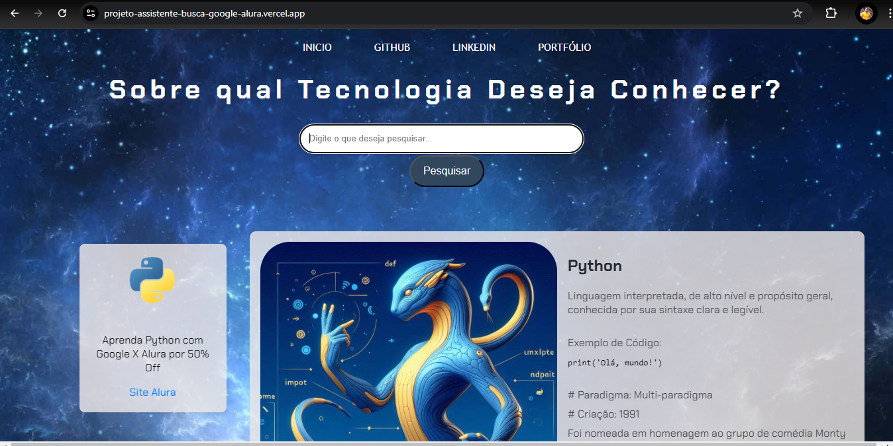

# Projeto - Buscas AvatarTech - Imersão Alura X Google

O Assistente de Busca é uma aplicação web que faz buscas em um banco de dados java script e retorna um avatar com as características da linguagem , assim como, uma breve descrição.
O projeto possui um direcionamento de propaganda a qual é encviada a propaganda com a linguagem mais pesquisada, responsividade para telas menores e foi criado após a Imersão Alura X Google.

## Funcionalidades

- Campo de input para digitar a pesquisa.
- Botão de "Pesquisar" para acionar a busca.
- Acionamento da busca pressionando a tecla "Enter".
- Direcionamento de propaganda, através da quantidade de vezes que se busca pelo nome da linguagem.
- Exibição de um avatar representativo para cada linguagem ou tecnologia pesquisada.

## Tecnologias Utilizadas

- **HTML**: Estrutura básica da aplicação.
- **CSS**: Estilos simples para a interface do usuário.
- **JavaScript**: Lógica para captura de eventos e acionamento da função de busca, além do direcionamento dos anúncios.

## Ensinado na imersão
- Pagina HTML e CSS.
- Como criar o sistema de busca e alimentação dos dados em javaScript.

## Atualização Feitas no Projeto
- Atualizaçãos de layout e background.
- Adicionei um menu de navegação a página web com links para inicio, github, linkedin e portfolio.
- Adicionei no HTML um campo para exibir a propaganda abaixo do botão pesquisar.
- Criei um algoritmo em javaScript que direciona a propaganda sobre a linguagem mais pesquisada.
- Adição de avatares representativos para cada linguagem ou tecnologia no banco de dados.
- O campo onde é digitado a pesquisa se apaga quando clicado o botão pesquisar.


## Banco de Dados
As seguintes linguagens e tecnologias estão incluídas no banco de dados do projeto para pesquisa:

| JavaScript | Python    | Java      | C#        | HTML       | CSS       | Kotlin    | R         | C++        | Assembly  |
|------------|-----------|-----------|-----------|------------|-----------|-----------|-----------|------------|-----------|
| C          | PHP       | Go        | Swift     | TypeScript | Ruby      | Scala     | Dart      | Rust       | Perl      |
| GitHub     | Docker    | JSON      | YAML      | SQL        | Linux     | Windows   |           |            |           |

## Estrutura de Arquivos

```bash
├── index.html       # Página principal
├── style.css        # Estilos da aplicação
├── dados.js         # Dados javaScript  
└── app.js           # Lógica JavaScript
```



## Agradecimentos
Este projeto foi desenvolvido graças à imersão oferecida pela Alura e Google, onde aprendi conceitos importantes de desenvolvimento web e pude avançar significativamente na minha jornada como desenvolvedor. Agradeço a essas plataformas por fornecerem um ambiente de aprendizado tão rico e acessível, ajudando a transformar ideias em realidade.

## Contribuições
Contribuições são bem-vindas! Sinta-se à vontade para abrir uma issue ou enviar um pull request com sugestões e melhorias.
